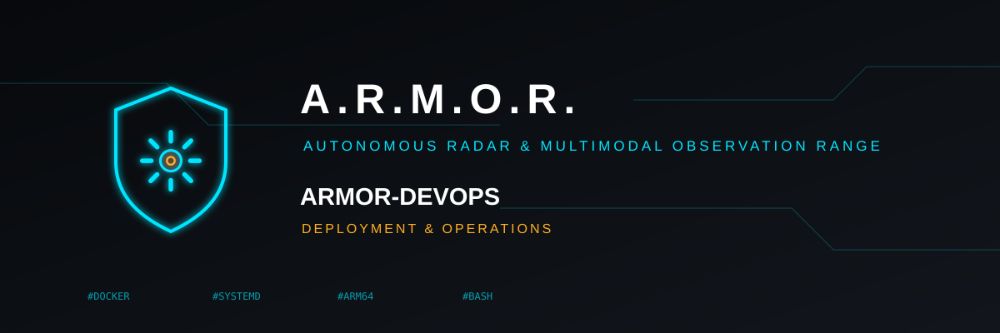

<p align="center">
  
</p>

# 🚀 ARMOR-DEVOPS

<p align="center">
  🇺🇸 <b>English</b> |
  <a href="README_spa.md">🇪🇸 Español</a> |
  <a href="README_fra.md">🇫🇷 Français</a> |
  <a href="README_ita.md">🇮🇹 Italiano</a> |
  <a href="README_deu.md">🇩🇪 Deutsch</a> |
  <a href="README_zho.md">🇨🇳 简体中文</a> |
  <a href="README_jpn.md">🇯🇵 日本語</a>
</p>

### Deployment topology and the isolated CM5 test bench

<p align="center">
  
  
  
  
</p>

---

**Honesty check - what runs today:** The CM5 bench installer has been run on a real CM5 that hosts other software, which stayed healthy. The Docker Compose topology and its optional TLS profile have been built and run for real with Docker Engine in WSL (`scripts/test_compose.sh`, 12 checks, which found and fixed three faults), but **not on the Jetson**. The backup and restore scripts have a passing round-trip test.

---

## 🎯 Overview

* **A host firewall for the core machine** (`scripts/firewall_core.sh`): the broker's port only from the field network, the server's and Studio's ports only from the clients' network (when it is given), in a table of its own that mentions nothing else and accepts the rest; `apply --rollback-after` removes the rules again unless you confirm them, so a mistake cannot shut you out. The rules and the refusals are tested (36 checks, nothing is loaded); it has been loaded on no machine yet, and the VLANs themselves are still a design for the router and the switch.
* **CM5 test bench:** `scripts/deploy_cm5.sh` builds in a clean copy, sends one archive and runs `scripts/install_cm5.sh`, which creates its own user, its own directory and two systemd units on their own ports (three with `--with-mqtt`: A.R.M.O.R.'s own Mosquitto on port 18883, verified on a real CM5), with resource limits, and never touches another project ([details](docs/CM5_TEST_BENCH.md)).
* **Compose topology:** a non-anonymous Mosquitto broker with one identity per node, the server, and Studio behind an nginx that proxies `/api/`; only Studio is published, on loopback. Hardened containers, an internal core network and named volumes for state.
* **Devices and readings on the bench broker:** the server may listen on and command `armor/device/#` and read `armor/node/+/info`, `armor/solar/#` and `armor/electrical/#`; `scripts/mqtt_identity.sh add device NAME` gives one device its own topics and `add bridge NAME` a Zigbee2MQTT or Shelly bridge all of them. `scripts/mqtt_identity.sh electrical-switching NODE_ID on` is the only thing that lets the server command the switch of an electrical node (off by default; `off` takes it away). `add alarm-node ID` gives an alarm node its `armor/alarm/ID/state` and `result` and nothing else, and `scripts/mqtt_identity.sh alarm-commands NODE_ID on` is the only thing that lets the server arm and disarm it (off by default; `off` takes it away); the server reads `armor/alarm/#`.
* **Secrets:** `scripts/generate_secrets.sh` creates random secrets and prints none; `scripts/check-required-env.sh` refuses missing, placeholder, short or repeated values.
* **Backup and restore:** `scripts/backup_data.sh` makes an AES-256 encrypted, verified and checksummed archive of the server data (evidence excluded unless asked); `scripts/restore_data.sh` lists it or restores it without ever overwriting existing data. The camera key is deliberately **not** in the archive.
* **TLS:** an optional `tls` Compose profile puts Caddy, with its own local certificate authority, in front of Studio ([details](docs/BACKUP_AND_TLS.md)).
* **Every service of the bench:** `install_cm5.sh` also installs, on request, the observation service (`--with-ai`), the voice service (`--with-voice`), the administration agent that lets Studio start, stop and restart services and edit the configuration files from a closed list of actions (`--with-admin`) and the daily encrypted backup (`--with-backup`); a later run remembers what was installed before.

## 📂 Repository Structure

```text
ARMOR-DEVOPS/
├── docker-compose.yml, .env.example, mosquitto/
├── caddy/     Caddyfile (TLS)
├── scripts/   deploy_cm5, install_cm5, generate_secrets, check-required-env, validate-compose, backup_data, restore_data, test_backup, test_compose, firewall_core, test_firewall, mqtt_identity
└── docs/      DEPLOYMENT_BOUNDARY, CM5_TEST_BENCH, BACKUP_AND_TLS
```

## 🛠️ Development Environment

```bash
scripts/generate_secrets.sh          # .env and secrets/ (Git-ignored)
scripts/check-required-env.sh
docker compose config --quiet && docker compose up --build
scripts/deploy_cm5.sh --host <cm5> --user <user> --key <key> --apply   # the test bench
scripts/backup_data.sh --data-dir <data> --out-dir <backups> --passphrase-file <file>
```

See the [deployment boundary](docs/DEPLOYMENT_BOUNDARY.md).

## 🔗 Related Projects

**A.R.M.O.R.** (Autonomous Radar & Multimodal Observation Range) is a perimeter-security system made of independent repositories. Each one has its own version, its own tests and its own README; this is the family:

* **[ARMOR-COMMON](https://github.com/JuanenRac/ARMOR-COMMON)** - Message contracts, validators, conformance vectors and generated types
* **[ARMOR-RADAR](https://github.com/JuanenRac/ARMOR-RADAR)** - Field-node firmware for ESP32-S3 with three radars and its own web panel
* **[ARMOR-SOLAR](https://github.com/JuanenRac/ARMOR-SOLAR)** - Solar inverter and battery protocols and the messages of a gateway node
* **[ARMOR-ELECTRICAL](https://github.com/JuanenRac/ARMOR-ELECTRICAL)** - Electrical node: meters, the message of the network's readings and the rules for switching
* **[ARMOR-ALARM](https://github.com/JuanenRac/ARMOR-ALARM)** - Alarm node and panel: zones, arming, delays, siren and PIN, with the server or without it
* **[ARMOR-HMI](https://github.com/JuanenRac/ARMOR-HMI)** - Touch panel: the state of the system on a wall screen, arming and acknowledging, and the home of the voice assistant
* **[ARMOR-NETWORK](https://github.com/JuanenRac/ARMOR-NETWORK)** - The local network: its devices, the internet and what changes
* **[ARMOR-SERVER](https://github.com/JuanenRac/ARMOR-SERVER)** - Central coordinator: telemetry, alarms, devices, solar readings and cameras
* **[ARMOR-STUDIO](https://github.com/JuanenRac/ARMOR-STUDIO)** - Web console: cameras, radar, alarms, solar energy and the 2D/3D site designer
* **[ARMOR-ANDROID-CONTROL](https://github.com/JuanenRac/ARMOR-ANDROID-CONTROL)** - Android operator client with a live 2D/3D radar
* **[ARMOR-SERVER-AI](https://github.com/JuanenRac/ARMOR-SERVER-AI)** - Visual inference policy that explains its decisions and never actuates
* **[ARMOR-VOICE-AI](https://github.com/JuanenRac/ARMOR-VOICE-AI)** - Offline voice intents with a confirmation that cannot be forged
* **[ARMOR-HARDWARE](https://github.com/JuanenRac/ARMOR-HARDWARE)** - Enclosures, electronics and the bench acceptance matrix
* **ARMOR-DEVOPS** (this repository) - Deployment, the CM5 test bench, backup and TLS
* **[ARMOR-SIMULATOR](https://github.com/JuanenRac/ARMOR-SIMULATOR)** - Offline telemetry simulator with repeatable faults
* **[ARMOR-UPDATER](https://github.com/JuanenRac/ARMOR-UPDATER)** - Detects, installs and updates the ecosystem's own repositories
* **[ARMOR-DOCS](https://github.com/JuanenRac/ARMOR-DOCS)** - Architecture, security baseline and the capability matrix

## 📚 Documentation & Community

Where to read more:

* [Capability matrix: what is proven and what is not](https://github.com/JuanenRac/ARMOR-DOCS/blob/main/docs/CAPABILITY_MATRIX.md)
* [Project catalogue: versions and how the repositories depend on each other](https://github.com/JuanenRac/ARMOR-DOCS/blob/main/docs/PROJECT_CATALOG.md)
* [Changelog of this repository](CHANGELOG.md)
* [License (GPL-3.0-or-later)](LICENSE)
* Questions, ideas and reports: electrohobby3d@gmail.com

## 👤 AUTHOR

**JuanenRac (Electro Hobby 3D)** · electrohobby3d@gmail.com

## 📜 LICENSE

GPL-3.0-or-later - see [LICENSE](LICENSE).
